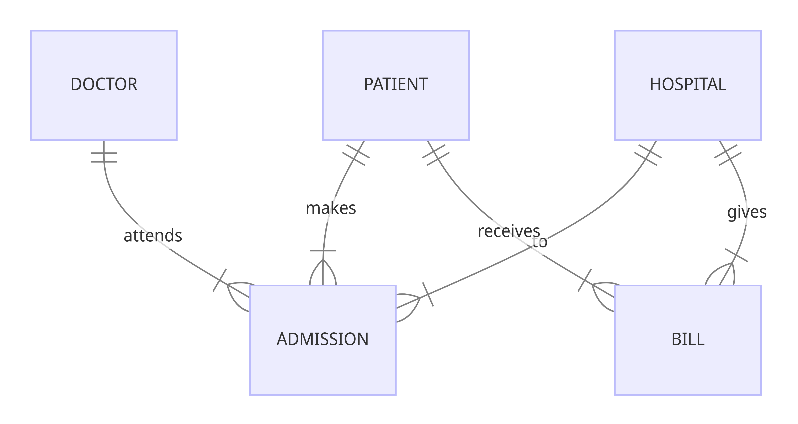

# Design Document

By Caleb Lee

Video overview: <https://www.youtube.com/watch?v=uqXb24G4yGg&ab_channel=CalebLee>

## Scope

The National Healthcare System Database includes all entities necessary to maintain the nation's hospital records in terms of the information about their stay in the hospital and outstanding bills. As such, included in the database's scope is:

* Patients, including their medical and financial records
* Doctors, including basic identifying information
* Hospitals, including location information
* Admissions, includes which doctor attended to the admission, what hospital the admission belongs to, what medication and test results were conducted during the admission, and the discharge date
* Bills, including the amount due to the hospital

Out of scope are elements like insurance providers that restrict the type of rooms a patient can be covered for, nurses that attend to which admissions, transfers of patients from one hospital to another etc.

## Functional Requirements

This database will support:

* CRUD operations for patients, admissions and bills, including the indication in the database that a patient has been discharged
* Bring up the past and present admissions of a specific patient
* Track the current patients that are admitted to a specific hospital
* Track outstanding bills of a specific patient

Note that in this iteration, the system does not support the payment of hospital bills.

## Representation

Entities are captured in SQLite tables with the following schema.

### Entities

The database includes the following entities:

#### Patients

The `patients` table includes:

* `id`, which specifies the unique ID for the patient as an `INTEGER`. This column thus has the `PRIMARY KEY` constraint applied.
* `first_name`, which specifies the patient's first name as `TEXT`, given `TEXT` is appropriate for name fields.
* `last_name`, which specifies the patient's last name. `TEXT` is used for the same reason as `first_name`.
* `age`, which specifies the patient's age. `INTEGER` is used to indicate their age in years.
* `gender`, which specifies the patient's gender. `TEXT` is used to indicate Male or Female.
* `blood_type`, which specifies the patient's blood type. `TEXT` is used to indicate blood type A+, O etc.
* `medical_condition`, which specifies the primary medical condition or diagnosis associated with the patient, hence `TEXT` is used.
* `bank_account_number`, which specifies the patient's bank account number. `INTEGER` is used to store the patient's bank account number. A `UNIQUE` constraint ensures no two patients have the same bank account.

All columns in the `patients` table are required and hence should have the `NOT NULL` constraint applied. No other constraints are necessary.

#### Doctors

The `doctors` table includes:

* `id`, which specifies the unique ID for the doctor as an `INTEGER`. This column thus has the `PRIMARY KEY` constraint applied.
* `first_name`, which specifies the doctor's first name as `TEXT`, given `TEXT` is appropriate for name fields.
* `last_name`, which specifies the doctor's last name. `TEXT` is used for the same reason as `first_name`.

All columns in the `doctors` table are required and hence should have the `NOT NULL` constraint applied. No other constraints are necessary.

#### Hospitals

The `hospitals` table includes:

* `id`, which specifies the unique ID for the doctor as an `INTEGER`. This column thus has the `PRIMARY KEY` constraint applied.
* `name`, which specifies the hospital's name as `TEXT`, given `TEXT` is appropriate for name fields.
* `location`, which specifies the hospital's location. `TEXT` is used for the name of the location.

All columns in the `hospitals` table are required and hence should have the `NOT NULL` constraint applied. No other constraints are necessary.

#### Admissions

The `admissions` table includes:

* `id`, which specifies the unique ID for the admission as an `INTEGER`. This column thus has the `PRIMARY KEY` constraint applied.
* `patient_id`, which is the ID of the patient who is admitted as an `INTEGER`. This column thus has the `FOREIGN KEY` constraint applied, referencing the `id` column in the `patients` table to ensure data integrity.
* `doctor_id`, which is the ID of the doctor assigne to that admission as an `INTEGER`. This column thus has the `FOREIGN KEY` constraint applied, referencing the `id` column in the `doctors` table.
* `hospital_id`, which is the ID of the hospital the patient was admitted in as an `INTEGER`. This column thus has the `FOREIGN KEY` constraint applied, referencing the `id` column in the `hospitals` table.
* `admission_date`, which specifies when the patient was admitted and be stored as `DATETIME`. The default value for the `admission_date` attribute is the current timestamp, as denoted by `DEFAULT CURRENT_TIMESTAMP`.
* `type`, which specifies the type of admission, which can be 'Emergency', 'Elective' or 'Urgent', thus `TEXT` is used.
* `room_number`, which specifies the room number the patient is staying in as an `INTEGER`. Multiple patients can share the same room.
* `discharged_date`, which specifies when the patient was discharged and be stored as `DATETIME`. The default value for the `discharged_date` attribute is NULL, as denoted `DEFAULT NULL` because the discharge date cannot be assumed to be the same as the admission date. There is a contraint that `discharged_date` cannot be earlier than `admission_date`.

All columns in the `admissions` table are required and hence should have the `NOT NULL` constraint applied, with the exception of `discharged_date`. No other constraints are necessary.

#### Bills

The `bills` table includes:

* `id`, which specifies the unique ID for the bill as an `INTEGER`. This column thus has the `PRIMARY KEY` constraint applied.
* `patient_id`, which is the ID of the patient who is admitted as an `INTEGER`. This column thus has the `FOREIGN KEY` constraint applied, referencing the `id` column in the `patients` table to ensure data integrity.
* `hospital_id`, which is the ID of the hospital the patient was admitted in as an `INTEGER`. This column thus has the `FOREIGN KEY` constraint applied, referencing the `id` column in the `hospitals` table.
* `amount`, which is the payment due to the hospitalisation, as a float, by the patient who was admitted. This column is represented with a `NUMERIC` type affinity, which can store floats.
* `paid`, which indicates whether the bill was paid by the patient. This column is represented with a `INTEGER` type affinity, where 0 represents outstanding, 1 represents paid.

All columns in the `bills` table are required and hence should have the `NOT NULL` constraint applied. No other constraints are necessary.

### Relationships

The below entity relationship diagram describes the relationships among the entities in the database.

As detailed by the diagram:

* A patient can be admitted to 1 to many hospitals in their lifetime, while an admission can have one and only one patient associated with it.
* A doctor can be assigned to 1 to many admissions. At the same time, an admission can have one and only one doctor assigned to it.
* A hospital can receive 1 to many admissions at one time, while an admission can be assigned to one and only one hospital.
* A bill is given by one and only one hospital. At the same time, a hospital can generate 1 to many bills.
* A bill is given to one and only one patient. At the same time, an patient can receive 1 to many bills in their lifetime.

## Optimizations

Per the typical queries in `queries.sql`, it is common for users of the database to access all admissions associated with any particular patient. For that reason, indexes are created on the `first_name`, `last_name` columns to speed the identification of patients by those columns when viewing past and present admissions of a patient and their outstanding fees.

Similarly, it is also common practice for a user of the database to concerned with viewing all current admissions of a particular hospital. As such, an index is created on the `name` column in the `hospitals` table to speed the identification of hospitals by name.

## Limitations
Currently, the addition of a new bill is manual. This can be improved by creating a trigger to add bill after a patient is discharged. Current schema also assumes that unlimited capacities of a hospital and its respective rooms.
